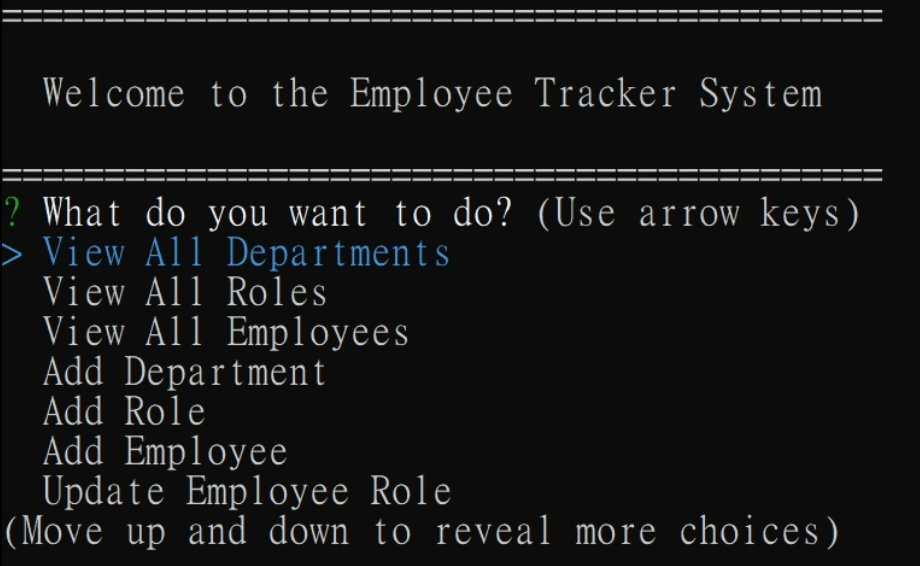

[](https://opensource.org/licenses/MIT)

# 12-Employee-Tracker

This is a Employee Tracker. The app asks a user to view their team departments, roles, employees, or add departments, roles or employees.

## Table of Contents
1. [Setup](#setup)
2. [Design](#design)
3. [Links](#links)
4. [Demo](#demo)
5. [License](#license)

<a name="setup"></a>

## Setup

Before start, make sure there's a database selected. If there's no existed datavase, you can log in to your mysql and use below code to build a default database and tables.

```
soruce ./db/schema.sql;
soruce ./db/seeds.sql;
```

Once you have a database selected, you can start the app by 

```
npm install && npm start
```

<a name="design"></a>

## Design

* All code is included in the server.js. It uses inquirer, util, console.table libraries
* All prompt commands are written within the server.js file
* The connection.js in config connects to the data using your own name, password.
* Database schema.sql and seeds.sql are stored in the db folder

<a name="links"></a>

## Links

Please check out [Github Page](https://github.com/shaotangyen/12-Employee-Management-System) for the app.

<a name="demo"></a>

## Demo

The following video link demonstrates the Employee Tracker app: [Click to watch](https://drive.google.com/file/d/1DjCdYQxosbbftXZKKfjLhFZPvV4H8HOk/view?usp=sharing).



<a name="license"></a>

## License

Copyright 2021 Shao Yen

Permission is hereby granted, free of charge, to any person obtaining a copy of this software and associated documentation files (the "Software"), to deal in the Software without restriction, including without limitation the rights to use, copy, modify, merge, publish, distribute, sublicense, and/or sell copies of the Software, and to permit persons to whom the Software is furnished to do so, subject to the following conditions:

The above copyright notice and this permission notice shall be included in all copies or substantial portions of the Software.

THE SOFTWARE IS PROVIDED "AS IS", WITHOUT WARRANTY OF ANY KIND, EXPRESS OR IMPLIED, INCLUDING BUT NOT LIMITED TO THE WARRANTIES OF MERCHANTABILITY, FITNESS FOR A PARTICULAR PURPOSE AND NONINFRINGEMENT. IN NO EVENT SHALL THE AUTHORS OR COPYRIGHT HOLDERS BE LIABLE FOR ANY CLAIM, DAMAGES OR OTHER LIABILITY, WHETHER IN AN ACTION OF CONTRACT, TORT OR OTHERWISE, ARISING FROM, OUT OF OR IN CONNECTION WITH THE SOFTWARE OR THE USE OR OTHER DEALINGS IN THE SOFTWARE.